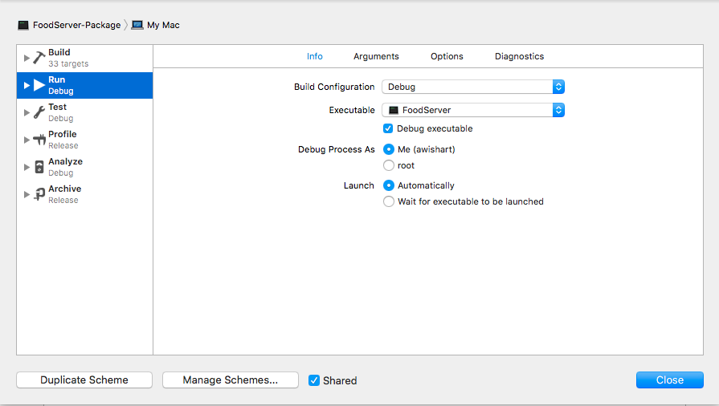

# Adding a Database to FoodTracker Server with Swift-Kuery

<p align="center">
<a href= "http://kitura.io/">

</a>
</p>

<p align="center">
<a href= "http://swift-at-ibm-slack.mybluemix.net/">

</a>
</p>

This tutorial builds upon the server and application created by following the [FoodTrackerBackend](https://github.com/IBM/FoodTrackerBackend) tutorial. These instructions demonstrate how to add a PostgreSQL database to the FoodTracker server using [Swift-Kuery](https://github.com/IBM-Swift/Swift-Kuery) and [Swift-Kuery-PostgreSQL](https://github.com/IBM-Swift/Swift-Kuery-PostgreSQL) so data persists between server restarts.


## Pre-Requisites:
This tutorial follows on from the FoodTracker application and server created by following the [FoodTrackerBackend](https://github.com/IBM/FoodTrackerBackend) tutorial. If you have completed FoodTrackerBackend there are no further pre-requisites.

If you have not completed the [FoodTrackerBackend](https://github.com/IBM/FoodTrackerBackend) tutorial follow the steps below to get started:

1. Ensure you have Swift 4, Xcode 9.x and Kitura 2.x installed.

2. Ensure you have CocoaPods installed:

`sudo gem install cocoapods`

3. Open a terminal window and clone the FoodTracker application and server:

`git clone https://github.com/Andrew-Lees11/SwiftPersistanceTutorial.git`

4. Switch to the "completedFoodBackend" branch to pull in the backend code:
```
cd SwiftPersistanceTutorial
git checkout completedFoodBackend
```
5. Use Cocoapods to install app dependencies:
```
cd FoodTrackerBackend/iOS/FoodTracker
pod install
```
6. Open the FoodTracker application in Xcode
```
open FoodTracker.xcworkspace/
```
This Xcode workspace contains the FoodTracker mobile app, which can be run by clicking the play button.

## Connecting A PostgreSQL Database
### Creating a PostgreSQL Database
The Food Tracker application is taken from the Apple tutorial for building your first iOS application. In [FoodTrackerBackend Tutorial](https://github.com/IBM/FoodTrackerBackend), we created a server and connected it to the iOS application. This server allows created meals to be posted to the server and viewed by the user at [localhost:8080/meals](http://localhost:8080/meals). As the meals are stored on the server, the meal data is lost if the server is restarted. To solve this problem, we will start by creating a PostgreSQL database for the meals to be stored in.

1. Install PostgreSQL:
```
brew install postgresql
brew services start postgresql
```
You should see a message that `postgresql` has been started or the service is already running. This installation will also have installed `createdb` and `psql` which will be used as clients to your locally running PostgreSQL database.

2. Create a database called FoodDatabase to store the data:
```
createdb FoodDatabase
```
3. Open the PostgreSQL command line for your database:
```
psql FoodDatabase
```
4. Create a table to contain your meals, by pasting this into the command line you initiated in the previous step:
```
CREATE TABLE meals (
    name varchar(100) PRIMARY KEY,
    photo text NOT NULL,
    rating integer
);
```
**Note** Name has been designated the primary key, therefore every meal name must be unique.

5. View your table to ensure it has been created:
```
TABLE meals;
```
At this point it will be empty since we have not inserted anything.

6. Type `\q` and then press ENTER to quit `psql`.

### Adding Swift-Kuery dependencies to your server
[Swift-Kuery](https://github.com/IBM-Swift/Swift-Kuery) is a database abstraction layer, it works alongside a specific database library, such as [Swift-Kuery-PostgreSQL](https://github.com/IBM-Swift/Swift-Kuery-PostgreSQL), to allow a user to easily query a SQL database in Swift. These two libraries are added to our `Package.swift` file, so the Server can access them.

1. Open a new terminal window and go into your server `Package.swift` file
```
cd SwiftPersistenceTutorial/FoodTrackerBackend/FoodServer/
open Package.swift
```
2. Add the following two lines to the dependencies in your `Package.swift` file to add Swift-Kuery and Swift-Kuery-PostgreSQL to the app.
```swift
.package(url: "https://github.com/IBM-Swift/Swift-Kuery.git", .upToNextMinor(from: "1.0.0")),
.package(url: "https://github.com/IBM-Swift/Swift-Kuery-PostgreSQL.git", .upToNextMinor(from: "1.0.1")),
```
3. Change the targets in your `Package.swift` file to include Swift-Kuery and Swift-Kuery-PostgreSQL, as below.
```swift
.target(name: "FoodServer", dependencies: [ .target(name: "Application"), "Kitura" , "HeliumLogger", "SwiftKuery", "SwiftKueryPostgreSQL"]),
.target(name: "Application", dependencies: [ "Kitura", "Configuration", "CloudEnvironment","SwiftMetrics","Health", "SwiftKuery", "SwiftKueryPostgreSQL"]),
```
### Generate your FoodServer Xcode project
Now we have added the dependencies to our `Package.swift` file, we can generate our FoodServer Xcode project to make editing the code easier. FoodServer is a pure Swift project and so the following steps could also be achieved by editing the .swift files.

1. Generate the FoodServer Xcode project:
```
cd SwiftPersistenceTutorial/FoodTrackerBackend/FoodServer/
swift package generate-xcodeproj
open FoodServer.xcodeproj/
```
2. Click on the "FoodServer-Package" text on the top-left of the toolbar and select "Edit Scheme" at the bottom of the dropdown menu.
3. In "Run", change the "Executable" dropdown to FoodServer, your scheme should look like the image below. Once you're happy click "Close".


Now when you press play, Xcode will start your FoodTracker server listening on port 8080. You can see this by going to [http://localhost:8080/](http://localhost:8080/ ) which will show the default Kitura landing page.

### Create a Meals Table class
To work with the meals table in the database, Swift-Kuery requires a matching class. We will now create a `Meals` class to match the meals table we created earlier in PostgreSQL.

1. In Xcode, open your `Sources > Application > Meal.swift` file.
2. Add SwiftKuery and SwiftKueryPostgreSQL to the import statements:
```swift
import SwiftKuery
import SwiftKueryPostgreSQL
```
3. Under these import statements, create a class which matches the Meals table you created in the database:
```swift
public class Meals : Table {
    let tableName = "meals"
    let name = Column("name")
    let photo = Column("photo")
    let rating = Column("rating")
}
```
4. Open your `Sources > Application > Application.swift` file
5. Add SwiftKuery and SwiftKueryPostgreSQL to the import statements for `Application.swift`
```swift
import SwiftKuery
import SwiftKueryPostgreSQL
```
6. Inside the `App` class create an instance of the  `Meals` table object by inserting the following line:
```swift
let meals = Meals()
```
below the line `let cloudEnv = CloudEnv()`

### Connecting to the PostgreSQL database
We will now connect our server to the PostgreSQL database. This will allow us to send and receive information using queries.

1. Staying within your `Application.swift` file set up a connection by inserting:
```swift
let connection = PostgreSQLConnection(host: "localhost", port: 5432, options: [.databaseName("FoodDatabase")])
```
below the line `let meals = Meals()`

2. Inside your `storeHandler` and `loadHandler` functions create a connection to the database.

Paste the following code on the first line of both your `loadHandler` and `storeHandler` functions:
```swift
connection.connect() { error in
    if error != nil {return}
    else {
        // Build and execute your query here.
    }
}
```

## Querying the PostgreSQL Database

Once you have connected to your database, the code to perform queries is handled by the Swift-Kuery library. This means the following code could be used for any supported SQL database.

### Handling an HTTP POST request
We are now going to add an insert query to our `storeHandler`. This will mean that when our server receives an HTTP `POST` request, it will take the received data and perform an SQL `INSERT` query to the database. This will store the data in the Meals table in the database.

1.  Inside the `storeHandler` function create an insert query.
```swift
// Build and execute your query here.
let insertQuery = Insert(into: self.meals, values: [meal.name, String(describing: meal.photo), meal.rating])
```
2. Add the following code to execute the insert query below your declaration of `insertQuery`.
```swift
connection.execute(query: insertQuery) { result in
    // Respond to the result here
}
```
**Note** After you execute the query you receive a `result` back containing the response from the database. Since we are performing an insert query this will only include whether the query was successful. For this tutorial, we assume the insert query was successful and ignore the returned value.

3. After the `connection.execute` block, respond to the client with the inserted meal to indicate success:
```swift
completion(meal, nil)
```
4. Remove the following two lines at the end of the original `storeHandler` function. These were used when the meal was being stored on the server, but we don't need them now we're using a database.
```swift
mealStore[meal.name] = meal
completion(mealStore[meal.name], nil)
```
Your completed `storeHandler` function should now look as follows:
```swift
func storeHandler(meal: Meal, completion: (Meal?, RequestError?) -> Void ) -> Void {
    connection.connect() { error in
        if error != nil {return}
        else {
            // Build and execute your query here.
            let insertQuery = Insert(into: meals, values: [meal.name, String(describing: meal.photo), meal.rating])
            connection.execute(query: insertQuery) { result in
                // Respond to the result here
            }
            completion(meal, nil)
        }
    }
}
```
Now when you create a meal in the application, the server will perform an `INSERT` query on the PostgreSQL database.

You can verify this by:
1. Starting the FoodTracker application in Xcode, making sure your FoodServer application is also still running.
2. Creating a meal in the application.
3. Accessing your database:
`psql FoodDatabase`
4. Viewing your meals table:
`TABLE meals;`

This should produce a table with the name, encoded photo string and rating of the meals in the FoodTracker app, including your newly added meal.

### Handling an HTTP GET request
We are going to add a `SELECT` query to our `loadHandler` function so when the server receives an HTTP `GET` request, it will be able to get the meals from the database. Now the data returned to the client will be from the database and will persist, even if the server is restarted.

1. Create a temporary mealstore inside your `loadHander` function.
Paste the following code on the first line of the `loadHander` function.
```swift
var tempMealStore: [String: Meal] = [:]
```
2.  Inside the `loadHander` function create a `Select` query.
```swift
// Build and execute your query here.
let selectQuery = Select(from :meals)
```
This query will return everything from the meals table.

3. Add the following code to execute the query below your declaration of `selectQuery`.
```swift
connection.execute(query: selectQuery) { queryResult in
    // Handle your result here
}
```

4. Iterate through the rows returned by the database.
```swift
// Handle your result here
if let resultSet = queryResult.asResultSet {
    for row in resultSet.rows {
        // Process rows
    }
}

```
5. For each row in the database, create a `Meal` object from the table and add it to your temporary mealstore:
```swift
// Process rows
guard let name = row[0], let nameString = name as? String else{return}
guard let photo = row[1], let photoString = photo as? String else{return}
guard let photoData = photoString.data(using: .utf8) else {return}
guard let rating = row[2], let ratingInt = Int(String(describing: rating)) else{return}
let currentMeal = Meal(name: nameString, photo: photoData, rating: ratingInt)
tempMealStore[nameString] = currentMeal
```
In this example, we have parsed the cells from each row to be the correct type to create the `Meal` object.
**Note** For this tutorial we will not be storing the photo data in the database, instead we will store a string description of the photo and then encode that string to data when creating the `Meal` object.

6. At the end of the `loadHandler` function, replace your old mealstore with your newly created `tempMealStore` and return this as your response to the `GET` request.
```swift
self.mealStore = tempMealStore
let returnMeals: [Meal] = self.mealStore.map({ $0.value })
completion(returnMeals, nil)
```

7. Your completed `loadHander` function should now look as follows:
```swift
func loadHandler(completion: ([Meal]?, RequestError?) -> Void ) -> Void {
    var tempMealStore: [String: Meal] = [:]
    connection.connect() { error in
        if error != nil {return}
        else {
            let selectQuery = Select(from :meals)
            connection.execute(query: selectQuery) { queryResult in
                if let resultSet = queryResult.asResultSet {
                    for row in resultSet.rows {
                        guard let name = row[0], let nameString = name as? String else{return}
                        guard let photo = row[1], let photoString = photo as? String else{return}
                        guard let photoData = photoString.data(using: .utf8) else {return}
                        guard let rating = row[2], let ratingInt = Int(String(describing: rating)) else{return}
                        let currentMeal = Meal(name: nameString, photo: photoData, rating: ratingInt)
                        tempMealStore[nameString] = currentMeal
                    }
                }
            }
        }
    }
    self.mealStore = tempMealStore
    let returnMeals: [Meal] = self.mealStore.map({ $0.value })
    completion(returnMeals, nil)
}
```

Now when you preform a `GET` call to your server, it will lookup and return the values from your database.
You can verify this by going to [http://localhost:8080/meals](http://localhost:8080/meals), where you should see your meals.
You can now restart your server and this data will persist, since it is stored within the database!

If you would like to view a complete ToDoList application with database persistence, which contains further examples of HTTP and SQL calls please see [PersistentiOSKituraKit](https://github.com/Andrew-Lees11/PersistentiOSKituraKit).
